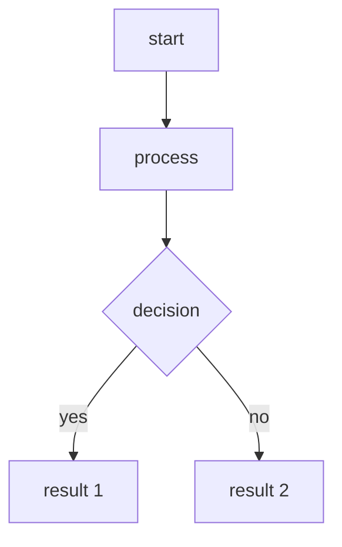

AroundMarket is a revolutionary decentralized prediction market platform built on blockchain technology. Our platform empowers users to participate in Yes/No predictions across a diverse range of categories including cryptocurrency, sports, games, politics, economy, technology, and weather events.

## prediction model
